# UEES - Programación Orientada a Objetos - Java

Proyecto desarrollado como parte de la asignatura de Programación Orientada a Objetos.

El sistema modela una empresa proveedora de tecnología y capacitación que puede atender tanto a personas naturales bajo un modelo B2C como a empresas bajo un modelo B2B.

## Objetivo

Aplicar los fundamentos de Programación Orientada a Objetos mediante el modelado de clientes, productos y proformas utilizando encapsulación, asociación, herencia, composición, abstracción, sobrescritura de métodos y polimorfismo.

---

## Semana 1 - Encapsulación y asociación

Durante la Semana 1 se implementaron las clases:

- `Producto`
- `Cliente`

### Conceptos aplicados

- Clases y objetos
- Encapsulación
- Atributos privados
- Getters y setters
- Asociación entre objetos

La clase `Producto` representa los artículos o servicios comercializados por la empresa.

La clase `Cliente` representa al comprador del sistema.

---

## Semana 2 - Herencia y composición

Durante la Semana 2 se amplió el modelo incorporando herencia y composición.

### Herencia

La clase `Producto` funciona como clase base para:

- `ProductoFisico`
- `ProductoDigital`

`ProductoFisico` incorpora atributos específicos como:

- peso
- ubicación de almacenamiento

`ProductoDigital` incorpora atributos como:

- tamaño en MB
- URL de descarga

### Composición

La clase `Proforma` contiene una colección de objetos `ItemProforma`.

Cada `ItemProforma` relaciona:

- un producto
- una cantidad
- el cálculo del subtotal

La clase `Proforma` permite agregar diferentes ítems y calcular el total de la operación comercial.

---

## Semana 3 - Polimorfismo, interfaces y clases abstractas

Durante la Semana 3 se extendió el sistema incorporando abstracción, sobrescritura de métodos y polimorfismo.

### Clase abstracta Cliente

La clase `Cliente` fue transformada en una clase abstracta:

```java
public abstract class Cliente
```

Además, define el método abstracto:

```java
public abstract double calcularDescuento();
```

Esto establece un contrato que debe ser implementado por las clases concretas que heredan de `Cliente`.

### ClienteMayorista

La clase `ClienteMayorista` hereda de `Cliente` y sobrescribe el método `calcularDescuento()`.

```java
@Override
public double calcularDescuento() {
    return 0.20;
}
```

El descuento aplicado es del **20 %**.

### ClienteMinorista

La clase `ClienteMinorista` también hereda de `Cliente` y proporciona su propia implementación de `calcularDescuento()`.

```java
@Override
public double calcularDescuento() {
    return 0.05;
}
```

El descuento aplicado es del **5 %**.

### Polimorfismo

La clase `Proforma` mantiene una referencia de tipo:

```java
private Cliente cliente;
```

Para calcular el total se ejecuta:

```java
double descuento = cliente.calcularDescuento();
return subtotal * (1 - descuento);
```

El método ejecutado depende del tipo real del objeto almacenado en `cliente`.

Por esta razón, `Proforma` no necesita utilizar condicionales para determinar si el cliente es mayorista o minorista.

El comportamiento se determina dinámicamente mediante polimorfismo.

### Resultados

Para un subtotal de:

```text
Laptop:    $850.00
Curso:     $240.00
------------------
Subtotal: $1090.00
```

se obtienen los siguientes resultados:

| Tipo de cliente | Descuento | Total |
|---|---:|---:|
| ClienteMayorista | 20 % | $872.00 |
| ClienteMinorista | 5 % | $1035.50 |

Esto demuestra que la misma operación:

```java
cliente.calcularDescuento()
```

produce comportamientos diferentes dependiendo del tipo concreto del objeto.

---

## Clases principales

- `Cliente` — clase abstracta
- `ClienteMayorista`
- `ClienteMinorista`
- `Producto`
- `ProductoFisico`
- `ProductoDigital`
- `ItemProforma`
- `Proforma`

---

## Modelo general

```text
                    Cliente
                   <<abstract>>
                  /           \
                 /             \
                v               v
      ClienteMayorista    ClienteMinorista
              |                  |
              |                  |
              +--------+---------+
                       |
                       v
                    Proforma
                       |
                       v
                  ItemProforma
                       |
                       v
                    Producto
                   /        \
                  /          \
                 v            v
        ProductoFisico   ProductoDigital
```

---

# Diagramas UML

## Semana 1

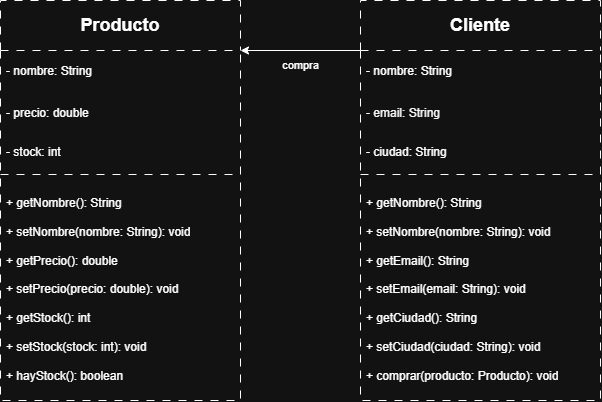

## Semana 2

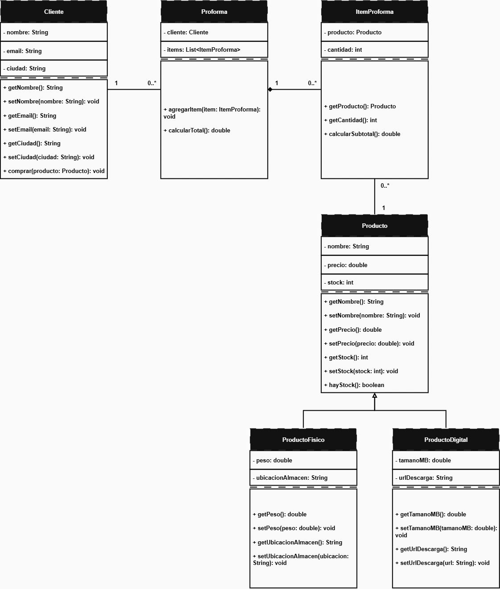

## Semana 3

El diagrama de Semana 3 incorpora:

- clase abstracta `Cliente`
- método abstracto `calcularDescuento()`
- `ClienteMayorista`
- `ClienteMinorista`
- generalización
- sobrescritura
- polimorfismo
- relaciones con `Proforma`
- composición con `ItemProforma`
- jerarquía de productos

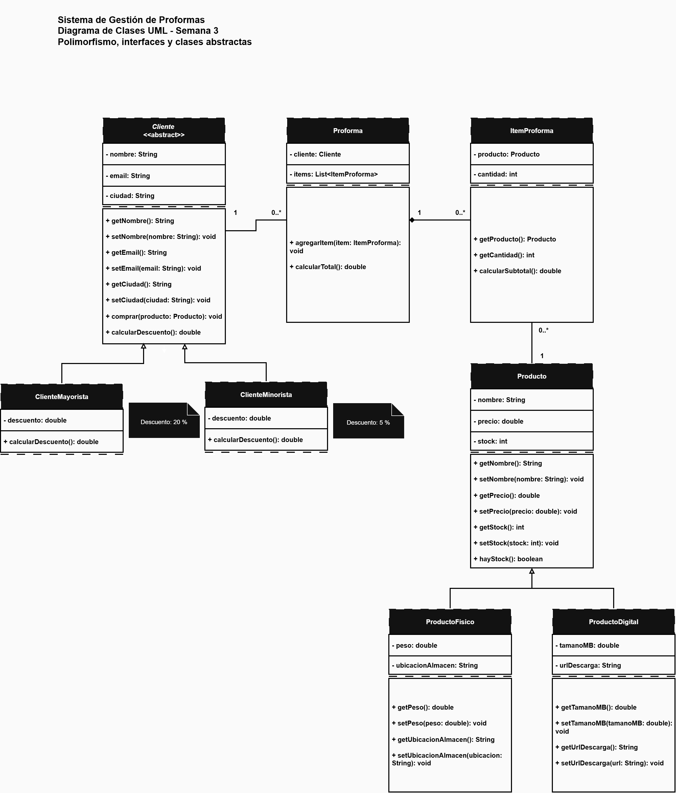

El archivo editable de diagrams.net también se encuentra en:

```text
docs/uml/uml_semana3_polimorfismo.drawio
```

---

# Evidencias - Semana 3 Java

## 1. Cliente como clase abstracta

Declaración de `Cliente` como clase abstracta:

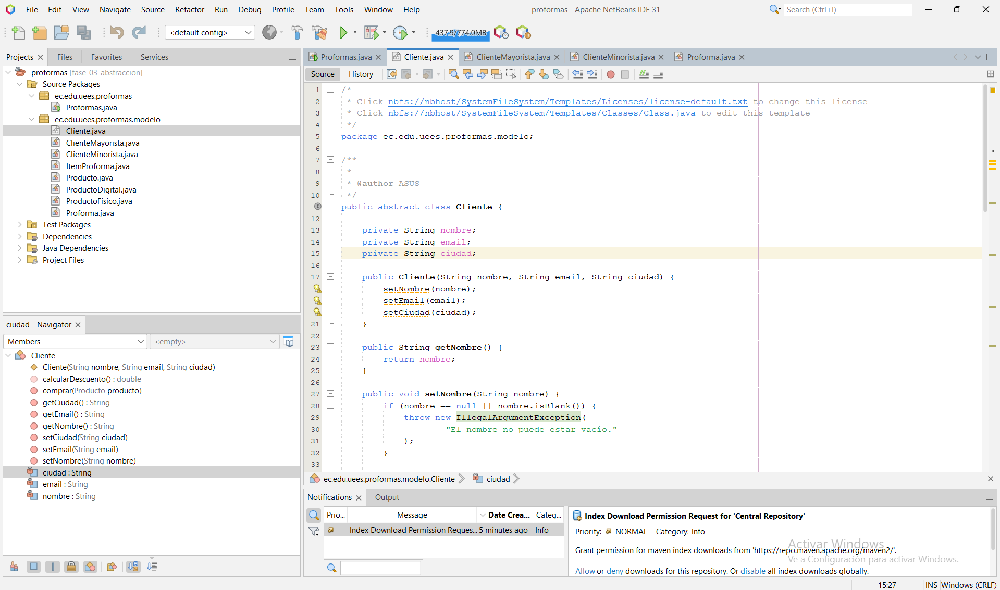

Método abstracto `calcularDescuento()`:

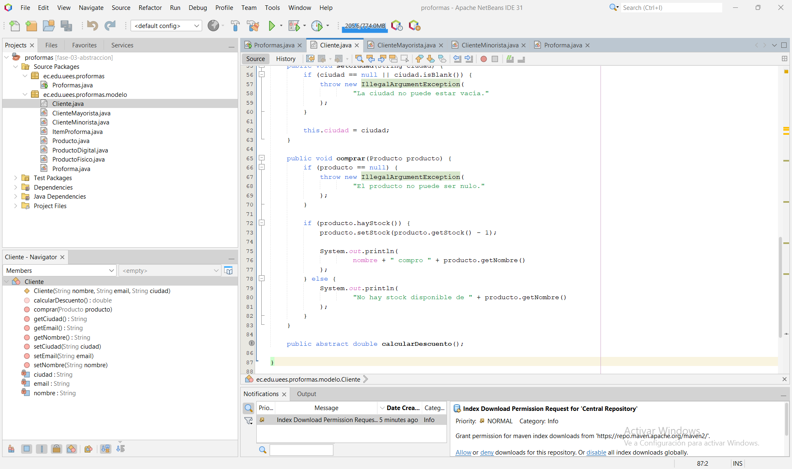

## 2. ClienteMayorista

Implementación de `ClienteMayorista` con descuento del 20 %:

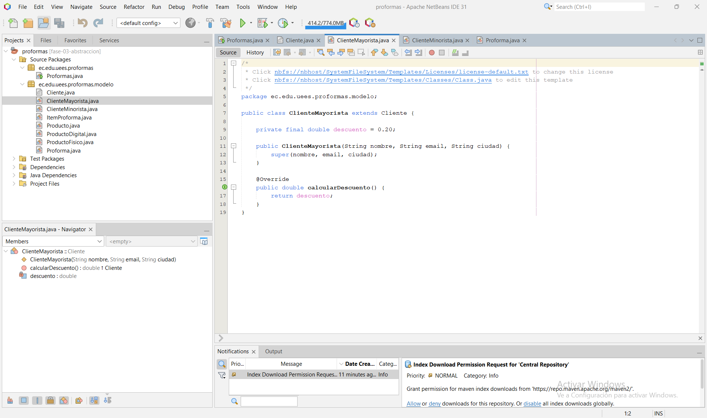

## 3. ClienteMinorista

Implementación de `ClienteMinorista` con descuento del 5 %:

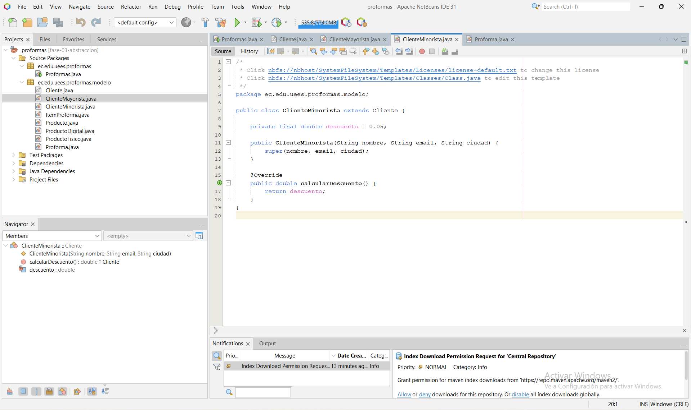

## 4. Polimorfismo

Uso del método `calcularDescuento()` a través de la abstracción `Cliente`:

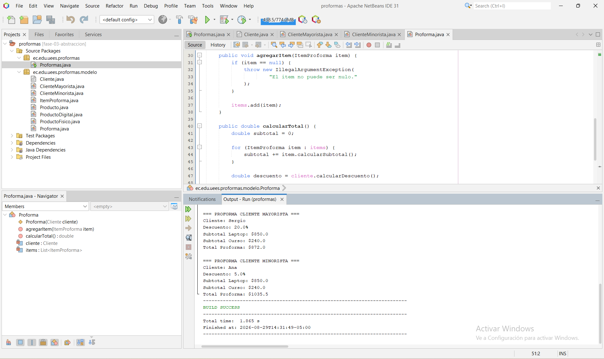

## 5. Prueba en Windows PowerShell

Compilación y ejecución independiente del proyecto utilizando `javac` y `java`:

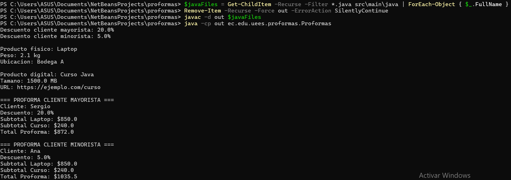

## 6. Entorno Java en Fedora

Verificación de la rama Git y del entorno Java/OpenJDK utilizado en Fedora Linux:

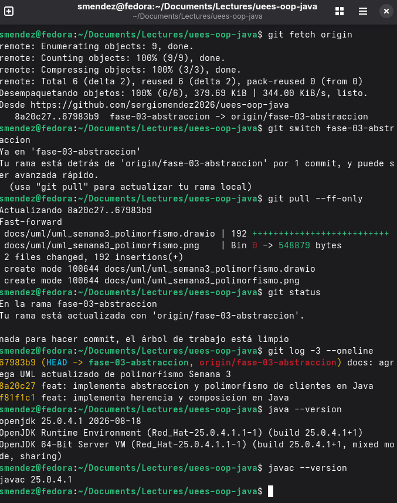

## 7. Prueba en Fedora Linux

Compilación y ejecución completa del proyecto en Fedora:

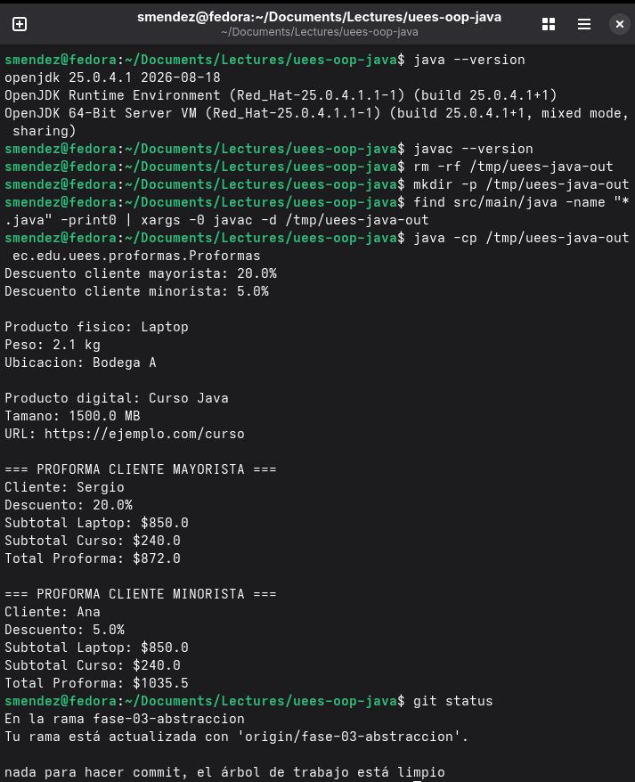

Los resultados obtenidos en Windows y Fedora son equivalentes, demostrando la portabilidad de la implementación Java.

---

# Ejecución

## Apache NetBeans

La clase principal es:

```text
ec.edu.uees.proformas.Proformas
```

Puede ejecutarse directamente desde Apache NetBeans.

## Windows PowerShell

Desde la raíz del repositorio:

```powershell
$javaFiles = Get-ChildItem -Recurse -Filter *.java src\main\java | ForEach-Object { $_.FullName }

Remove-Item -Recurse -Force out -ErrorAction SilentlyContinue

javac -d out $javaFiles

java -cp out ec.edu.uees.proformas.Proformas
```

## Fedora Linux

```bash
rm -rf /tmp/uees-java-out

mkdir -p /tmp/uees-java-out

find src/main/java -name "*.java" -print0 | \
xargs -0 javac -d /tmp/uees-java-out

java -cp /tmp/uees-java-out ec.edu.uees.proformas.Proformas
```

---

## Ejemplo de ejecución Semana 3

```text
Descuento cliente mayorista: 20.0%
Descuento cliente minorista: 5.0%

Producto fisico: Laptop
Peso: 2.1 kg
Ubicacion: Bodega A

Producto digital: Curso Java
Tamano: 1500.0 MB
URL: https://ejemplo.com/curso

=== PROFORMA CLIENTE MAYORISTA ===
Cliente: Sergio
Descuento: 20.0%
Subtotal Laptop: $850.0
Subtotal Curso: $240.0
Total Proforma: $872.0

=== PROFORMA CLIENTE MINORISTA ===
Cliente: Ana
Descuento: 5.0%
Subtotal Laptop: $850.0
Subtotal Curso: $240.0
Total Proforma: $1035.5
```

---

## Tecnologías utilizadas

- Java
- Programación Orientada a Objetos
- Apache NetBeans
- JDK / OpenJDK
- Maven
- Windows PowerShell
- Fedora Linux
- UML
- diagrams.net
- Git
- GitHub

---

## Conceptos de Programación Orientada a Objetos aplicados

- Clases y objetos
- Encapsulación
- Asociación
- Herencia
- Composición
- Abstracción
- Clases abstractas
- Métodos abstractos
- Sobrescritura
- Polimorfismo
- Enlace dinámico

---

## Autor

Sergio Méndez
